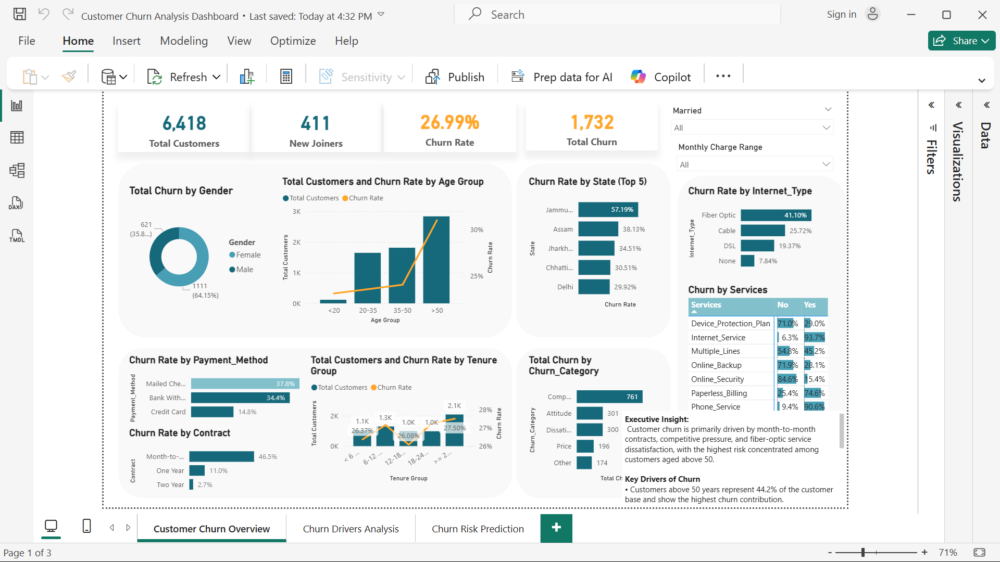

# Customer Churn Analysis

**End-to-End Data Analytics Project**
SQL | Python | Machine Learning | Power BI

This project analyzes customer behavior to identify churn drivers and predict customers likely to leave.
Data was extracted using SQL, modeled using Python (Random Forest), and visualized in an interactive Power BI dashboard.

---

# Dashboard Preview


<p align="center">

</p>

Power BI dashboard analyzing churn patterns across customer demographics, contracts, services, and tenure.
---

# Key Insights

### 1. Older customers show the highest churn risk

Customers **aged 50+ represent 44.2% of the customer base** and show the highest churn rates.

### 2️. Contract type is the strongest retention factor

* **Month-to-month:** 46.5% churn
* **Two-year contracts:** 2.7% churn

Long-term contracts drastically improve retention.

### 3️. Fiber optic users churn the most

Customers using **fiber optic internet show a 41.1% churn rate**, suggesting pricing or service dissatisfaction.

### 4️. Missing add-on services increases churn

Customers without **online security, backup, or device protection** churn significantly more.

### 5️. Competitive offers drive most churn

The leading churn reason is **competitor offers**, followed by dissatisfaction and service issues.

---

# Predictive Model

A **Random Forest model** was built to identify customers likely to churn.

**Results**

* **384 customers predicted to churn**
* High-risk groups include:

  * Month-to-month contracts
  * Mid-tenure customers

---

# Business Recommendations

* Encourage **long-term contracts through discounts**
* Improve **fiber optic pricing or service quality**
* Bundle **value-added services**
* Target **retention campaigns toward high-risk segments**

---

# Repository Structure

```
customer-churn-analysis
│
├── sql
│   └── churn_analysis.sql
│
├── notebooks
│   └── churn_prediction.ipynb
│
├── data
│   └── prediction_data.csv
│
├── dashboard
│   └── churn_dashboard.pbix
│
└── README.md
```
